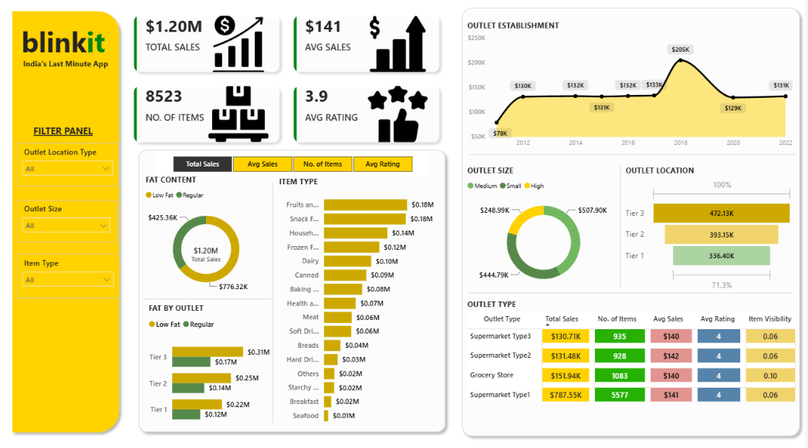
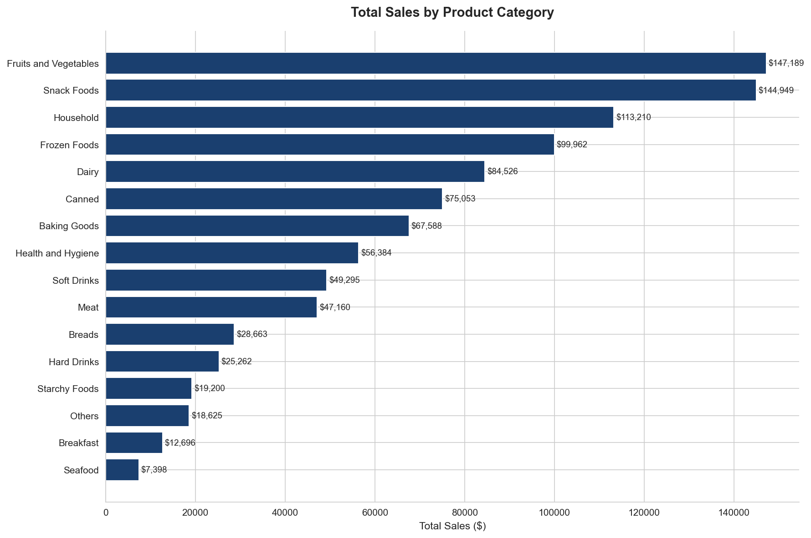
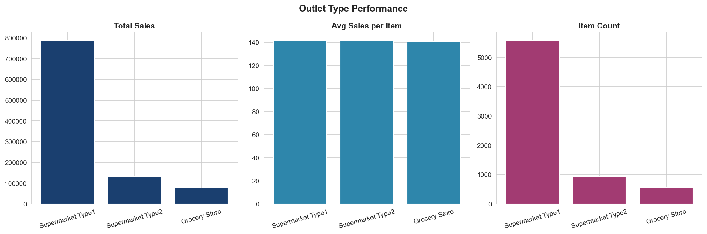
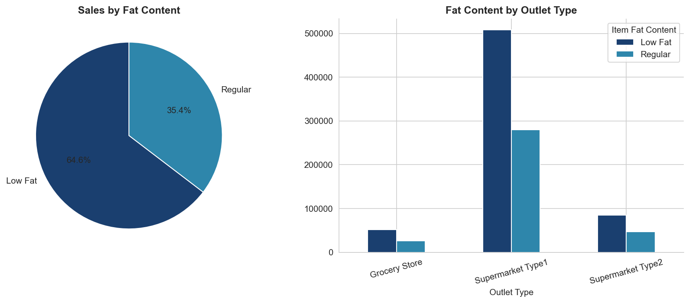
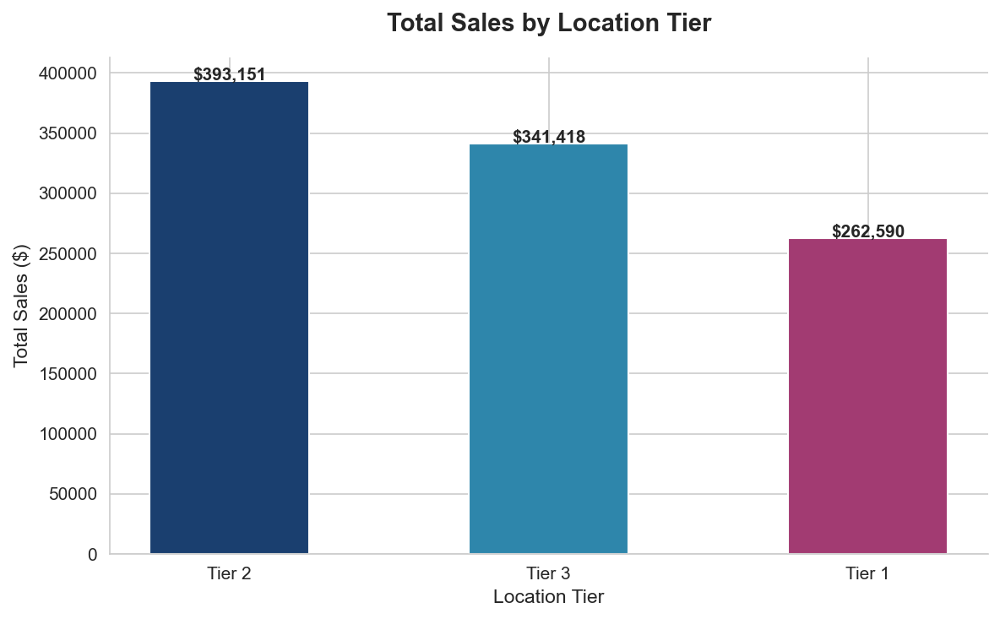
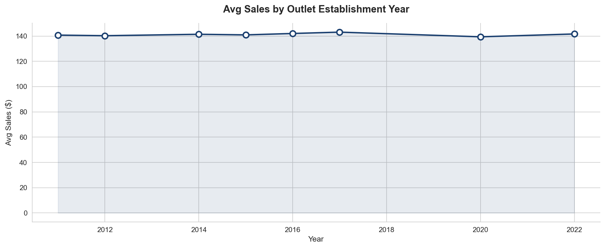

<h1 align="center">🛒 Blinkit Sales & Delivery Analytics</h1>

<p align="center">
  
  
  
  
  
  
</p>

<p align="center">
  <b>End-to-end sales and operations analytics for Blinkit —
  India's last minute delivery app</b><br>
  Power BI dashboard + Python EDA | 8,523 records |
  4 outlet types | 3 location tiers
</p>

---

## 📌 Business Problem

Blinkit operates across multiple outlet types, sizes, and city
tiers. Business leaders need to quickly understand:

- Which outlet types and locations generate the most revenue?
- Which product categories and fat content types drive sales?
- How has outlet performance changed over establishment years?
- Where should Blinkit focus expansion for maximum impact?

This project answers all these questions through an interactive
Power BI dashboard backed by Python EDA.

---

## 🛠️ Tools & Technologies

| Tool | Purpose |
|------|---------|
| Power BI | Interactive dashboard and KPI reporting |
| DAX | Calculated measures and KPI logic |
| Power Query | Data cleaning and transformation |
| Python (Pandas, Matplotlib, Seaborn) | EDA and chart generation |
| Excel | Raw data source |

---

## 📦 Dataset

| Parameter | Value |
|-----------|-------|
| Total Records | 8,523 items |
| Outlet Types | Supermarket Type 1, 2, 3 and Grocery Store |
| Location Tiers | Tier 1, Tier 2, Tier 3 |
| Outlet Sizes | Small, Medium, High |
| Item Categories | 16 categories including Fruits, Snacks, Dairy |
| Fat Content | Low Fat and Regular |

---

## 📊 Dashboard Preview



---

## 📈 Key Metrics

| Metric | Value |
|--------|-------|
| 💰 Total Sales | $1.20M |
| 📦 Total Items | 8,523 |
| 💵 Avg Sales per Item | $141 |
| ⭐ Avg Customer Rating | 3.9 / 5 |
| 🏆 Best Outlet | Supermarket Type 1 — $787.55K |
| 📍 Best Location | Tier 3 — $472.13K |
| 🥦 Top Categories | Fruits & Vegetables + Snack Foods |

---

## 🔍 Key Insights

### 1. 🏪 Supermarket Type 1 Dominates Revenue
> **Supermarket Type 1 = $787.55K** — 65% of total revenue

Despite having the lowest avg sales per item ($141),
Supermarket Type 1 wins on sheer volume (5,577 items).
Grocery Stores have the highest item count per outlet
(1,083) showing strong operational density.

---

### 2. 📍 Tier 3 Cities Lead — Surprising but Strategic
> **Tier 3 = $472.13K | Tier 2 = $393.15K | Tier 1 = $336.40K**

Tier 3 cities generate the most revenue — counter-intuitive
but reflective of quick-commerce penetration in smaller
cities where Blinkit faces less competition from organised
retail. This represents the biggest expansion opportunity.

---

### 3. 🥗 Low Fat Items Outsell Regular by 1.8x
> **Low Fat = $776.32K vs Regular = $425.36K**

Customers strongly prefer Low Fat products across all
outlet types and tiers. This reflects India's growing
health consciousness and is consistent across Tier 1,
Tier 2, and Tier 3 markets.

---

### 4. 🥦 Fruits & Snacks Drive Category Revenue
> **Fruits & Vegetables = $0.18M | Snack Foods = $0.18M**

These two categories jointly lead all 16 product types.
Together they represent 30% of total sales — making them
the core of Blinkit's inventory strategy.

---

### 5. 🏗️ Medium Outlets Outperform on Revenue
> **Medium size = $507.90K vs High = $248.99K vs Small = $444.79K**

Medium outlets generate the most total revenue despite not
being the largest format. High-size outlets underperform
relative to their operational footprint — suggesting
potential inefficiency in large-format stores.

---

### 6. 📅 2018 Was Peak Establishment Year
> **$205K avg sales** for outlets established in 2018

Outlets established in 2018 show the highest average
sales — suggesting that era had optimal location selection
or favourable market conditions. Post-2018 outlets show
a decline worth investigating.

---

## 💡 Business Recommendations

| # | Recommendation | Based On |
|---|---------------|---------|
| 1 | Expand Supermarket Type 1 in Tier 3 cities | Highest revenue type + highest growth tier |
| 2 | Increase Low Fat SKUs across all categories | Low Fat outsells Regular by 1.8x |
| 3 | Prioritise Fruits, Snacks, and Household inventory | Top 3 revenue categories |
| 4 | Audit High-size outlet efficiency | Lowest revenue despite largest footprint |
| 5 | Study 2018 outlet location strategy | Peak avg sales — replicate selection criteria |

---

## 🔬 Python EDA

Full exploratory data analysis done in Python covering:
- Data cleaning and Fat Content standardisation
- Sales distribution by category, outlet type, and tier
- Fat content breakdown by outlet
- Establishment year trend analysis
- Correlation analysis

📓 See `notebooks/blinkit_sales_analysis.ipynb`

---

## 📊 EDA Charts

### Sales by Product Category


### Outlet Type Performance


### Fat Content Analysis


### Sales by Location Tier


### Outlet Establishment Year vs Sales


---

## 📁 Repository Structure

```
Blinkit-Sales-Delivery-Analytics/
│
├── 📂 data/
│   └── blinkit_grocery_data.xlsx
│
├── 📂 notebooks/
│   └── blinkit_sales_analysis.ipynb
│
├── 📂 outputs/
│   ├── 01_sales_by_category.png
│   ├── 02_outlet_performance.png
│   ├── 03_fat_content.png
│   ├── 04_location_tier.png
│   ├── 05_establishment_year.png
│   └── blinkit_clean.csv
│
├── 📂 power_bi/
│   └── Blinkit_Sales_Delivery_Analytics.pbix
│
├── dashboard_preview.png
└── README.md
```

---

## 🚀 How to Use

**Power BI Dashboard:**
1. Download `power_bi/Blinkit_Sales_Delivery_Analytics.pbix`
2. Open in **Power BI Desktop**
3. Use Filter Panel to slice by Outlet Location, Size, and Item Type

**Python Notebook:**
1. Install: `pip install pandas matplotlib seaborn openpyxl`
2. Open `notebooks/blinkit_sales_analysis.ipynb` in Jupyter
3. Run all cells — charts save to `outputs/` folder

---

## 🎯 Skills Demonstrated

- Power BI dashboard design with custom theme and layout
- DAX calculated measures for KPI cards
- Power Query data cleaning and transformation
- Python EDA with Pandas, Matplotlib, and Seaborn
- Business insight generation from retail data
- Stakeholder-ready KPI reporting

---

## 👩‍💻 About

**Aprajita Dixit** — Data & Business Analyst

[](https://www.linkedin.com/in/dixitaprajita/)
[](https://github.com/aprajitad)
